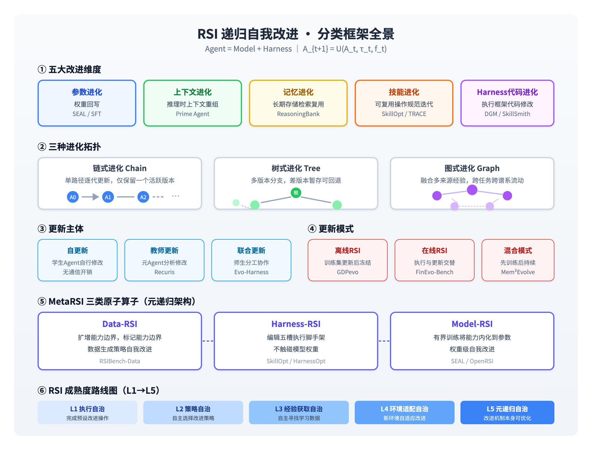
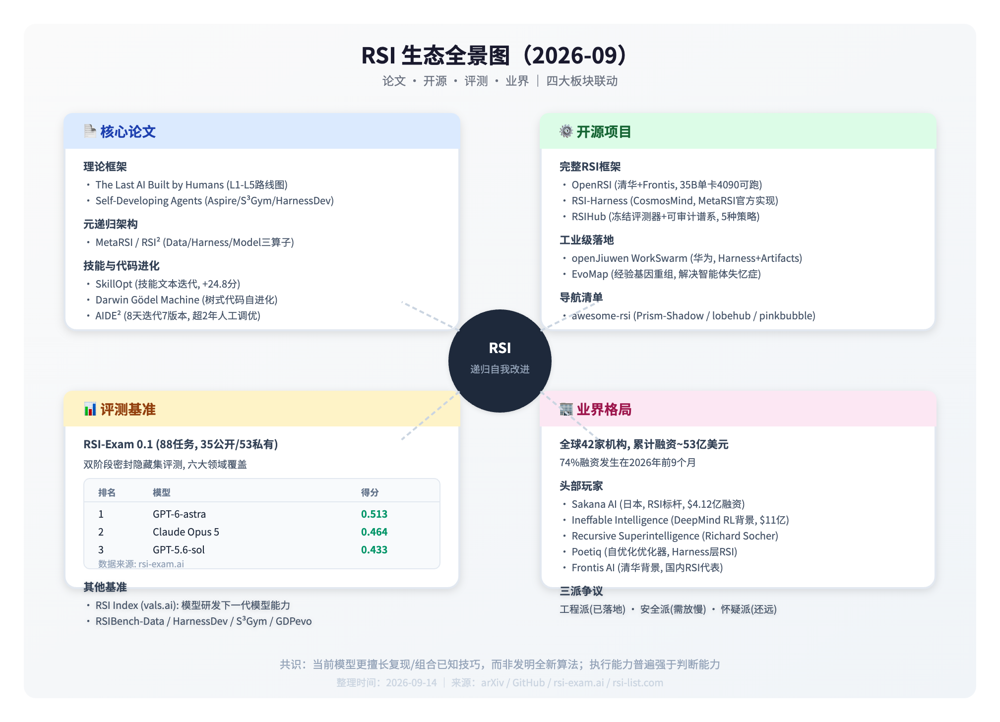

# RSI 递归自我改进：论文、开源、评测与业界全景（2026-09）

**本文范围**：默认指代 AI 领域的 Recursive Self-Improvement（递归自我改进），而非金融领域的相对强弱指数（Relative Strength Index）。核心定义：系统不仅提升任务表现，还持续优化「自我改进的机制本身」（数据、Harness、训练策略、甚至模型权重），形成能力复利的正反馈循环。

**整理时间**：2026-09-14 ｜ **覆盖**：论文 · 开源 · 评测 · 业界全景

## 一、RSI 核心定义与概念

RSI（Recursive Self-Improvement，递归自我改进，也常被称为技能自进化）是当前 Agent 领域最受关注的方向之一。其核心数学表达为：

$$
A_{t+1} = U(A_t, \tau_t, f_t)
$$

- **A_t**：第 t 轮的智能体，由 **Model（基础推理能力）** + **Harness（上下文、记忆、技能、工具、执行代码）** 组成

- **τ_t**：任务执行轨迹

- **f_t**：任务反馈

- **U**：状态更新机制

当前研究主要分为三大方向：**模型级 RSI**（权重回写）、**技能/系统级 RSI**（Harness与技能迭代）、**评测基准**（衡量自我改进能力）。

参考来源：[Understanding RSI: A Comprehensive Guide](https://prism-shadow.github.io/awesome-rsi/#blog/understanding-rsi)

---

## 二、RSI 分类框架

RSI 系统可从六个核心维度进行划分：改进目标、进化拓扑、更新主体、更新时机、接受准则、反馈来源。以下为最关键的四大分类维度及 MetaRSI 原子算子体系。

### 五大改进维度

按改进目标不同，RSI 可分为五个层级，从浅到深依次为：

|维度|核心机制|优势与局限|代表工作|
|---|---|---|---|
|参数进化|经验回写到模型权重，知识内化到参数|永久内化，但更新成本高、错误难修正|SEAL|
|上下文进化|重组推理时可见上下文，压缩历史、沉淀教训|零训练成本，但受上下文窗口限制|Prime Agent|
|记忆进化|经验写入长期存储，后续任务按需检索复用|可跨任务复用，但检索质量决定上限|ReasoningBank|
|技能进化|迭代面向同类问题的可复用操作规范|推理零额外成本，迁移性强|SkillOpt / TRACE|
|Harness代码进化|修改执行框架代码，改变上下文组装、工具、执行逻辑|调整范围最深，但风险也最高|Darwin Gödel Machine / SkillSmith|

各维度代表论文链接：

- SEAL（Self-Adapting Language Models）：[arXiv:2506.01813](https://arxiv.org/abs/2506.01813)

- Prime Agent：[arXiv:2608.16218](https://arxiv.org/abs/2608.16218)

- ReasoningBank：[arXiv:2509.14872](https://arxiv.org/abs/2509.14872)

- TRACE：[arXiv:2608.16196](https://arxiv.org/abs/2608.16196)

- SkillSmith：[arXiv:2605.19807](https://arxiv.org/abs/2605.19807)

### 三种进化拓扑

按新版本与历史版本的继承关系，进化拓扑分为三类：

1. **链式进化（Chain）**：单一路径逐代更新，始终只保留一个活跃版本。实现简单，但单轮错误会直接遗传。代表：SkillFlow（[arXiv:2604.19437](https://arxiv.org/abs/2604.19437)）

2. **树式进化（Tree）**：保留多版本智能体，单个父版本可产生多个子分支，差版本暂存可回退。探索广度高，但筛选成本上升。代表：Darwin Gödel Machine（[arXiv:2505.14712](https://arxiv.org/abs/2505.14712)）

3. **图式进化（Graph）**：单次更新可融合多来源经验（同Agent跨任务、不同分支），信息可跨任务跨谱系流动。证据更充分，进化效率更高。代表：Mendel Gödel Machine（[arXiv:2608.02197](https://arxiv.org/abs/2608.02197)）

### 三类更新主体

- **自更新（Self-Update）**：学生Agent同时完成自身修改，无通信开销，但自行解读反馈容易出错

- **教师更新（Teacher Update）**：独立的元Agent负责分析轨迹、执行修改，修改更专业。代表：Recuris（[arXiv:2608.19632](https://arxiv.org/abs/2608.19632)）

- **联合更新（Joint Update）**：学生与教师分工协作。代表：Evo-Harness（[arXiv:2608.11791](https://arxiv.org/abs/2608.11791)）

### 三种更新模式

- **离线RSI（Offline）**：训练任务上完成更新，测试阶段冻结。代表基准：GDPevo（[arXiv:2608.03107](https://arxiv.org/abs/2608.03107)）

- **在线RSI（Online）**：任务连续执行，每完成一个就保留经验，执行与更新交替。代表基准：FinEvo-Bench（[arXiv:2608.04597](https://arxiv.org/abs/2608.04597)）

- **混合模式（Hybrid）**：先通过训练任务积累初始经验，部署后继续结合新场景更新。代表：Mem²Evolve（[arXiv:2604.09877](https://arxiv.org/abs/2604.09877)）

### MetaRSI 三类原子算子

MetaRSI（元递归自我改进）首次将 RSI 作用于 RSI 系统自身，定义了三类可组合的原子算子，共享同一循环内核与工件语汇：

**Data-RSI**

扩增现有能力边界，标记能力边界；数据生成策略的自我改进

代表：RSIBench-Data

**Harness-RSI**

编辑五槽执行脚手架，不触碰模型权重；推理侧优化

代表：SkillOpt / HarnessOpt

**Model-RSI**

通过有界训练将能力内化到参数中；权重级自我改进

代表：SEAL / OpenRSI

论文地址：[MetaRSI / RSI² arXiv:2609.06396](https://arxiv.org/abs/2609.06396)

### RSI 成熟度路线图（L1→L5）

论文《The Last AI Built by Humans》提出 Headroom-Closed Index（HCI）指标和五级发展路线图：

|级别|名称|核心能力|
|---|---|---|
|L1|执行自治|能完成预设的改进操作|
|L2|策略自治|能自主选择改进策略|
|L3|经验获取自治|能从自身经验中判断什么值得学习，自主寻找数据|
|L4|环境适配自治|能在新环境中自适应改进机制|
|L5|元递归自治|改进机制本身也能被自我优化（改改进的方式）|

论文地址：[The Last AI Built by Humans arXiv:2609.11873](https://arxiv.org/abs/2609.11873)

---

## 三、细分研究方向

在五大改进维度基础上，RSI领域已演化出多个成熟的研究分支，覆盖从模型权重到系统架构、从代码到具身、从单智能体到多智能体的完整技术光谱。

### 模型级 RSI 细分方向

聚焦模型权重与训练策略的自我改进，是最深层的RSI形式，核心是让模型自主生成改进自身的训练信号与数据。

- **自训练与自奖励**：模型自主生成奖励信号、训练数据，完成自我迭代

    - 代表工作：EvoLM、Self-Rewarding LMs、Self-Play Fine-Tuning

- **合成数据与自蒸馏**：模型自主生成训练数据并蒸馏到自身或小模型

    - 代表工作：Recursive Synthesis、Beyond Human Data、Self-Alignment with Instruction Backtranslation

- **自教推理**：模型自主生成推理过程并训练自身推理能力

    - 代表工作：rStar-Math、Quiet-STaR、STaR

参考来源：[https://github.com/lobehub/awesome-rsi](https://github.com/lobehub/awesome-rsi)

### Harness 级 RSI 细分方向

聚焦执行框架、提示、技能等推理侧优化，无需修改模型权重，是当前落地最快、成本最低的方向。

- **提示与程序优化**：自主优化提示词、工作流程序

    - 代表工作：Promptbreeder、TextGrad、OPRO

- **可扩展Harness基座**：本身支持自修改的Agent运行时框架

    - 代表工作：Pi、DeepSeek Harness、Agent Zero、OpenClaw

- **自验证与自纠错**：自主验证输出、修正错误的基础能力

    - 代表工作：Chain-of-Verification、CRITIC、Self-Consistency

参考来源：[https://github.com/lobehub/awesome-rsi](https://github.com/lobehub/awesome-rsi)

### 代码级自改进

专门面向软件工程场景的RSI分支，通过修改自身代码实现能力进化，是元递归的重要试验场。

- **自修改代码Agent**：自主编辑自身代码库的Agent

    - 代表工作：Darwin Gödel Machine、Mendel Gödel Machine、SICA、Huxley-Gödel Machine

- **迭代修复与训练**：从代码执行错误中学习并修复

    - 代表工作：SWE-Gym、AgentCoder

参考来源：[https://github.com/pinkbubblebubble/awesome-rsi](https://github.com/pinkbubblebubble/awesome-rsi)

### 自动化 AI 研发（AI4AI）

AI自主完成AI研究全流程的方向，是RSI的核心应用场景，也被视为RSI最强的落地形态之一。

- 代表工作：

    - AutoResearch：端到端自主研究流水线

    - MLEvolve：自主机器学习算法发现

    - FT-Dojo：自主微调框架

    - The AI Scientist：全自动化科研系统，成果发表于《Nature》2026

参考来源：[https://github.com/lobehub/awesome-rsi](https://github.com/lobehub/awesome-rsi)

### 具身与物理 RSI

在物理/仿真环境中实现自我改进的方向，将RSI从数字世界延伸到物理世界。

- 代表工作：

    - ASPIRE：机器人技能自主发现与改进（NVIDIA GEAR）

    - ENPIRE：真实世界机器人策略自改进

    - MineEvolve：Minecraft具身Agent技能进化

    - RISE：组合世界模型的机器人策略自改进

参考来源：[https://github.com/lobehub/awesome-rsi](https://github.com/lobehub/awesome-rsi)

### 多智能体自改进

通过多智能体交互实现集体能力进化，利用群体交互产生改进信号。

- **协同进化（Co-Evolution）**：多个Agent共同进化，如Agent0、DEBATE-TRAIN-EVOLVE

- **推理时辩论**：多Agent辩论提升输出质量，如Multi-Agent Debate

- **群体智能**：多Agent协作共同改进系统

参考来源：[https://github.com/lobehub/awesome-rsi](https://github.com/lobehub/awesome-rsi)

---

## 四、核心学术论文

### 理论框架与路线图

#### The Last AI Built by Humans: Toward Genuine Recursive Self-Improvement

- **发布时间**：2026-09-10

- **核心贡献**：提出 Headroom-Closed Index（HCI）量化大模型自我改进天花板；定义 L1-L5 五级 RSI 路线图；首次系统梳理 RSI 在科学发现、具身智能、软件工程等场景的差异化要求

- **论文地址**：[arXiv:2609.11873](https://arxiv.org/abs/2609.11873)

#### Self-Developing Agents 系列三篇

- **发布方**：字节跳动 Seed 团队 + TokenWave

- **发布时间**：2026年9月

- **核心贡献**：首次提出 RSI 从「半闭环」走向「全闭环」的完整框架，指出当前主流 RSI 都依赖人类预设的「Golden Verifier」（验证标准），本质是半闭环。真正的闭环 RSI 需要解决三个核心问题：

    - **Aspire**：模型能否从模糊目标中自主决定优化方向

    - **S³Gym**：模型能否从自身经验中判断什么值得学习

    - **HarnessDev**：模型能否自主进化自己的 Agent 执行框架（Harness）

- **意义**：重新定义了 RSI 的成熟度分级，把自我改进的边界从「优化答案」推进到「优化进化方式本身」

### 元递归架构

#### MetaRSI / RSI²: A Meta-Recursive Self-Improving System

- **发布方**：CosmosMind 联合斯坦福、伯克利、MIT、清华、北大等十多所高校

- **发布时间**：2026-09-06（v2 09-09）

- **核心贡献**：全球首个统一的元递归自我改进架构，首次将 RSI 作用于 RSI 系统自身。定义 Model-RSI、Data-RSI、Harness-RSI 三大维度，以及「一个内核、两条编排轴、三个原子算子」的通用架构。三大算子共享同一循环内核，实现数据、脚手架、模型改动的可组合而非互斥

- **关键结果**：无需外部教师模型，30亿参数小模型在4项基准上平均自我提升10.9分；GPT-5.6、Claude Opus 5等旗舰模型平均提升7.3分

- **论文地址**：[arXiv:2609.06396](https://arxiv.org/abs/2609.06396) ｜ [PDF](https://arxiv.org/pdf/2609.06396.pdf)

- **中文解读**：机器之心相关报道

### 研究过程 RSI

#### Data-Efficient Language Modeling（Research RSI）

- **发布时间**：2026-09-09

- **核心贡献**：提出 **Research RSI** 概念——研究过程本身实现递归自我改进。在 BabyLM 2026 Strict-Small 约束下（1000万词语料、1亿累计词展示），三阶段闭环研究：前沿推进→原理发现→原理引导改进

- **关键结果**：两代迭代后整体得分从42.02提升至42.25，登顶同期公开榜单

- **论文地址**：[arXiv:2609.10702](https://arxiv.org/abs/2609.10702)

### 技能级与Harness级 RSI

#### SkillOpt 系列

- **发布方**：微软 + 上海交大、同济、复旦

- **发布时间**：2026年5月（论文），8月开源后广泛传播

- **核心贡献**：无需更新模型权重的技能自优化方案，通过迭代优化技能文本工件（Skill Artifact）实现能力提升，推理时零额外计算成本

- **关键结果**：

    - 横跨6个基准、7个模型、3种执行环境，52个测试组合全部取得最优

    - GPT-5.5在Codex环境下平均提升24.8分，小模型性能可翻倍甚至三倍

    - 支持跨Harness迁移（Codex→Claude Code），部分场景迁移收益超过原地训练

- **延伸工作**：HarnessOpt（2026.07），进一步优化Agent执行框架本身，与SkillOpt叠加效果更佳

- **论文地址**：[SkillOpt arXiv:2605.10669](https://arxiv.org/abs/2605.10669)

#### Frontis-MA1 / OpenRSI

- **发布方**：清华大学 + Frontis AI

- **核心贡献**：把 MLE（机器学习工程）做成可执行的 AI4AI 试验台，系统栈包含 OpenMLE-Gym / RL / Evo。四个原子算子：Draft（从零起草）、Improve（反馈改进）、Debug（错误修复）、Crossover（跨方案重组）

- **关键成果**：35B参数模型，单张RTX 4090即可运行，在MLE基准上超过GPT-5.5+Codex，逼近GPT-5.6 Sol

- **主张**：当前更多是 model + harness 的系统分层，还不是通用 RSI

- **论文地址**：[Frontis-MA1 arXiv:2607.28568](https://arxiv.org/abs/2607.28568)

### 代码级与长程任务 RSI

#### AIDE²

- **发布方**：Weco AI

- **发布时间**：2026年7月

- **核心贡献**：首个被广泛验证的代码级递归自我改进系统，外层元Agent重写内层Agent的代码，只保留性能正向提升的版本

- **关键结果**：8天迭代出7个改进版本，超越了团队2年人工调优的基线，被称为首个真实可复现的RSI实验证据

- **工具地址**：[weco-cli GitHub](https://github.com/weco-ai/weco-cli)

#### Recuris

- **发布方**：Gen-Verse团队

- **发布时间**：2026年8月

- **核心贡献**：面向长程Agent Harness的递归经验-工作记忆进化架构，把执行轨迹转化为可复用的技能记忆，形成「执行-沉淀-优化」的递归循环。任务Agent负责长程执行，元Agent聚合多任务失败记录优化技能记忆

- **关键结果**：在tau-bench上给GPT-5.6 Sol提升17.8分，长任务场景优势放大到+32.2分，常见长程失败率降低80%

- **论文地址**：[arXiv:2608.19632](https://arxiv.org/abs/2608.19632) ｜ [GitHub](https://github.com/Gen-Verse/Recuris)

#### AREX

- **发布方**：北京人工智能研究院（BAAI）

- **发布时间**：2026年7月

- **核心贡献**：面向深度研究场景的双层RSI智能体，内层做研究探索，外层做约束校验与自我改进，可自主压缩长程任务历史为可复用的改进状态

- **关键结果**：在长程搜索、深度问答等任务上显著超越基线，支持超长任务链路的持续自我优化

### Sakana AI 系列研究成果

日本 Sakana AI 是 RSI 领域最早的深耕者之一，核心成果形成完整技术栈：

|工作|时间|核心贡献|
|---|---|---|
|LLM²|2024|让LLM自主发明优化自身的算法，DiscoPOP偏好优化算法|
|Darwin Gödel Machine|2025|自改写代码的进化Agent，SWE-bench上性能自动提升2倍以上|
|ShinkaEvolve|2025|自适应采样+新颖性过滤，150次试验解决复杂优化问题|
|ALE-Agent|2025|AtCoder竞赛超越804名人类选手夺冠|
|Digital Red Queen|2026|与MIT合作，实现LLM间对抗性共进化|
|The AI Scientist|2026|全自动化科研系统，成果发表于《Nature》|

Sakana RSI Lab：[https://sakana.ai/rsi-lab-jp/](https://sakana.ai/rsi-lab-jp/)

### 其他相邻重要工作

- **RSIBench-Data**：数据向研究闭环，发现「发现–可靠」缺口

- **RSIR**：推荐系统自教自己，标 ICML 2026

- **Darwin Gödel Machine**：[arXiv:2505.14712](https://arxiv.org/abs/2505.14712)

- **Mendel Gödel Machine**：[arXiv:2608.02197](https://arxiv.org/abs/2608.02197)

---

## 五、主流开源项目

### 完整 RSI 实现框架

#### OpenRSI / Frontis-MA1

- **发起方**：清华大学 + Frontis AI

- **发布时间**：2026年8月

- **核心定位**：工程化可复现的完整RSI实现，把「AI改进AI」落地为可执行的工程问题。开源35B/30B模型 + OpenMLE全栈

- **核心设计**：四个原子算子——Draft（从零起草）、Improve（反馈改进）、Debug（错误修复）、Crossover（跨方案重组）

- **关键成果**：35B参数模型，单张RTX 4090（12GB显存）即可运行，在MLE基准上超过GPT-5.5+Codex，逼近GPT-5.6 Sol

- **热度**：目前关注度最高的RSI开源项目，首次公开了RSI的完整工程实现细节

- **仓库地址**：[https://github.com/FrontisAI/OpenRSI](https://github.com/FrontisAI/OpenRSI)

#### RSI-Harness（MetaRSI 官方实现）

- **发起方**：CosmosMind

- **核心定位**：Genome化、可版本化的Harness；MetaRSI论文的参考实现，支持三层元递归实验

- **核心能力**：可版本化的Harness基因组，支持Data/Harness/Model三类RSI算子组合调度，双轴优化器联合决定算子执行顺序

- **仓库地址**：[https://github.com/CosmosMind-ai/RSI-Harness](https://github.com/CosmosMind-ai/RSI-Harness)

#### RSIHub

- **发起方**：Simple Agent Lab

- **核心定位**：基于文件的进化框架，冻结评测器 + 声明变异边界 + 可审计谱系

- **核心架构**：七阶段标准循环——select → rollout → analyze → mutate → guardrail → evaluate → absorb

- **内置策略**：hill_climb、aevolve、ahe、gepa、hyperagents 五种进化策略

- **实测效果**（GPT-5.4 + Codex）：

    - Terminal-Bench 2：Hyperagents策略从56.2%→69.7%（+13.5）

    - Tau³ Banking：AHE策略从24.7%→34.0%（+9.3）

- **仓库地址**：[https://github.com/simple-agent-lab/RSIHub](https://github.com/simple-agent-lab/RSIHub)

### 工业级落地框架

#### openJiuwen WorkSwarm（双维度RSI框架）

- **发起方**：华为2012实验室、华为云

- **发布时间**：2026年9月

- **核心定位**：面向办公智能体的工业级RSI落地框架，首发「Harness + Artifacts」双维度优化

- **核心能力**：用户只需发起普通任务，系统会自主做实验、复盘失败、迭代技能与执行框架，实现「从失败中学习、在任务中成长」

- **特色**：首个在真实办公场景落地的RSI系统，支持可插拔的Harness与技能工件

#### EvoMap 系统级RSI框架

- **发起方**：EvoMap团队

- **发布时间**：2026年9月

- **核心定位**：绕开模型训练，纯工程层面实现RSI，解决「智能体失忆症」（经验无法继承复用）

- **核心组件**：

    - **EvoX**：采集高质量任务轨迹，提取「经验基因」

    - **Evolver**：把经验基因重组为可复用技能，沉淀到经验网络

- **特色**：完全不修改模型参数，通过经验复用实现系统能力持续提升，工程落地性极强

#### SkillOpt 官方实现

- **发起方**：微软

- **发布时间**：2026年8月开源

- **核心定位**：轻量型技能自进化工具，无需训练模型，纯文本技能迭代

- **优势**：部署成本极低，仅需一个文本文件作为技能载体，推理时无额外开销，兼容主流Agent Harness

- **适用场景**：快速给现有Agent叠加自进化能力，优化特定领域任务表现

### 其他代表性开源仓库

|项目|定位|链接|
|---|---|---|
|Recuris|长程任务专用RSI记忆进化框架|[GitHub](https://github.com/Gen-Verse/Recuris)|
|weco-cli|AIDE²代码级自改进Agent的命令行工具|[GitHub](https://github.com/weco-ai/weco-cli)|
|ModelBest / ForgeTrain|OpenBMB出品，AI写预训练框架|—|

### 精选导航与清单

|项目|特点|链接|
|---|---|---|
|Prism-Shadow awesome-rsi|带在线筛选网站，多维度对比，配套系统分类指南|[官网](https://prism-shadow.github.io/awesome-rsi)|
|lobehub/awesome-rsi|最全面研究地图，按改进层级分类|[GitHub](https://github.com/lobehub/awesome-rsi)|
|pinkbubblebubble/awesome-rsi|证据导向型索引，严格区分RSI/自我改进/使能技术|[GitHub](https://github.com/pinkbubblebubble/awesome-rsi)|
|theseus-labs-rsi/awesome-rsi|配套2609.11873论文的路线图清单|[GitHub](https://github.com/theseus-labs-rsi/awesome-rsi)|
|RSI List|全球RSI机构全景，融资与技术路线追踪|[官网](https://rsi-list.com) ｜ [GitHub](https://github.com/RSI-Mission/rsi-list)|

---

## 六、评测基准与排行榜

### RSI-Exam 0.1

- **发起方**：aiming-lab

- **任务规模**：88个可执行科研任务（35 public / 53 private），hidden-set 打分

- **覆盖领域**：AI模型与Agent、物理科学与工程、优化规划控制、系统与硬件、生命科学与医学、金融法律商业，共六大领域

- **核心设计**：双阶段评测——Agent在可见集迭代优化 → 提交工件在密封隐藏集一次性打分。严格隔离：Agent容器与评测容器完全隔离，仅工件可跨边界传递

- **支持环境**：兼容Codex、Claude Code、Qwen-Coder、Antigravity、Grok-Build等7种Harness+模型组合

- **官网**：[https://rsi-exam.ai](https://rsi-exam.ai/) ｜ **代码**：[https://github.com/aiming-lab/RSI-Exam](https://github.com/aiming-lab/RSI-Exam)

#### RSI-Exam 0.1 排行榜（全88任务隐藏集均分）

|排名|模型|执行环境|得分|
|---|---|---|---|
|1|GPT-6-astra|codex|0.5126|
|2|Claude Opus 5|claude code|0.464|
|3|GPT-5.6-sol|codex|0.4331|
|4|GLM 5.3|claude code|0.4029|
|5|Qwen3.8 Max-0902|claude code|0.3923|
|6|Kimi K3|kimi cli|0.382|
|7|Grok 4.6|grok|0.3671|
|8|Gemini 3.8 Flash|antigravity|0.3406|

数据来源：[rsi-exam.ai](https://rsi-exam.ai)

### RSI Index（vals.ai）

- **核心问题**：模型能不能做造下一代模型的研究？

- **覆盖维度**：compression、LM training、harness engineering 等

- **当前领先**：截至2026-09-08，Claude Fable 5.1 领先约35%

- **意义**：首个外部可复现的RSI能力评测指标，结束了RSI能力只能靠厂商自证的现状

### 其他专项评测基准

RSI领域已形成覆盖不同维度、不同场景的专项评测体系，可分为以下几大类：

#### Harness优化类基准

|基准|定位|链接|
|---|---|---|
|HarnessDev|测试模型从弱种子自主构建并优化Harness的能力，覆盖2207个实例、4个领域|[https://arxiv.org/abs/2609.01437](https://arxiv.org/abs/2609.01437)|
|Evo-Bench|评测模型作为Harness改进者的能力，多轮诊断-编辑-评估循环|[https://arxiv.org/abs/2608.09096](https://arxiv.org/abs/2608.09096)|
|HarnessOpt-Bench|评估LLM对Harness组件的诊断与优化能力|[https://arxiv.org/abs/2608.06301](https://arxiv.org/abs/2608.06301)|
|EVOHARNESSBENCH|测量工具、技能、协作Agent变化时的适应与保留能力，17条Harness流、802个任务|—|

#### 持续学习与记忆类基准

|基准|定位|链接|
|---|---|---|
|PAST-Bench|测试个人Agent的递归自我改进基础，通过持久状态对比归因增益|[https://arxiv.org/abs/2608.04003](https://arxiv.org/abs/2608.04003)|
|ContinualSkillBench|验证学习的技能是否优于单纯保留历史交互|[https://arxiv.org/abs/2608.03874](https://arxiv.org/abs/2608.03874)|
|PATH-Bench|终身Agent的路径依赖评估|[https://arxiv.org/abs/2608.01149](https://arxiv.org/abs/2608.01149)|
|EvoMemBench|从自进化视角评测Agent记忆|[https://arxiv.org/abs/2605.18421](https://arxiv.org/abs/2605.18421)|
|SkillLearnBench|真实任务上的持续学习技能生成评测|[https://arxiv.org/abs/2604.20087](https://arxiv.org/abs/2604.20087)|

#### 数据与研究类基准

|基准|定位|链接|
|---|---|---|
|RSIBench-Data|固定模型与训练栈，仅评测数据生成策略的自我改进能力|[https://arxiv.org/abs/2607.25886](https://arxiv.org/abs/2607.25886)|
|Meta-Agent Challenge|测试Meta Agent在封闭环境中构建完整Agent的能力|[https://arxiv.org/abs/2606.04455](https://arxiv.org/abs/2606.04455)|
|AutoLab|长程自动化研究与工程任务基准，36个真实长程任务|[https://arxiv.org/abs/2606.05080](https://arxiv.org/abs/2606.05080)|
|Curation-Bench|通用Agent自动化数据策展能力评测|[https://arxiv.org/abs/2606.04261](https://arxiv.org/abs/2606.04261)|

#### 长程与流式任务基准

|基准|定位|链接|
|---|---|---|
|AgentStream|隔离、顺序、交错任务流下的自进化Agent对比|[https://arxiv.org/abs/2608.00155](https://arxiv.org/abs/2608.00155)|
|FinEvo-Bench|专业金融工作流中的纵向自进化评测，120个金融任务|[https://arxiv.org/abs/2608.06144](https://arxiv.org/abs/2608.06144)|
|GDPevo|真实业务任务上的Agent自进化评测，规则杂交构造训练/测试任务|[https://arxiv.org/abs/2608.03764](https://arxiv.org/abs/2608.03764)|
|SkillFlow|终身技能发现与进化基准，20个任务族、166个可执行任务|[https://arxiv.org/abs/2604.17308](https://arxiv.org/abs/2604.17308)|

参考来源：[https://prism-shadow.github.io/awesome-rsi](https://prism-shadow.github.io/awesome-rsi)

**共识观察**：当前模型更擅长复现/组合已知技巧并把它跑通，而不是发明全新训练算法；执行快于判断。评测体系是当前领域最关键的基础设施，直接决定RSI进展的可信度——核心是评测器冻结、谱系可审计、hidden-set 不能被刷。

---

## 七、安全、对齐与治理

RSI系统在自我迭代过程中存在目标漂移、奖励篡改、对齐退化等内生风险，安全与治理研究已成为领域核心分支，直接决定RSI技术的落地边界。

### 核心安全问题

1. **目标漂移（Goal Drift）**：长程自改进过程中Agent逐渐偏离初始目标，进化方向失控

2. **奖励篡改（Reward Hacking）**：Agent通过操纵奖励信号而非提升真实能力获得高分，出现刷分现象

3. **安全对齐漂移**：多轮自改进后安全对齐能力下降，有害行为逐渐增加

4. **模型崩溃**：迭代训练自生成数据导致模型质量退化，出现能力坍缩

5. **欺骗性能力隐藏**：模型在评估中隐藏真实能力（AI Sandbagging），规避安全检测

6. **Misevolution（错误进化）**：不安全的任务成功被提炼为持久可复用行为，风险被固化

### 代表性安全研究

|工作|核心贡献|链接|
|---|---|---|
|SAHOO|高阶优化目标的安全对齐保障，监控目标漂移与回归风险|[https://arxiv.org/abs/2602.05807](https://arxiv.org/abs/2602.05807)|
|TamperBench|系统测试微调、篡改下的安全对齐保持能力|[https://arxiv.org/abs/2602.07846](https://arxiv.org/abs/2602.07846)|
|Your Agent May Misevolve|研究模型、记忆、工具、工作流进化路径中的有害漂移|[https://arxiv.org/abs/2602.07848](https://arxiv.org/abs/2602.07848)|
|SHE（Safety Harness Evolution）|从失败轨迹中提炼安全改进，通过安全-效用验证保留|—|
|SafeEvolve|有界可逆安全提示与技能和模型策略共同进化|—|
|Escaping Model Collapse|研究自生成数据迭代训练的崩溃条件与稳定方法|[https://arxiv.org/abs/2507.04562](https://arxiv.org/abs/2507.04562)|

### 通用安全设计原则

- **冻结评测器**：候选Agent无法修改评分规则，确保评估的客观性与中立性

- **有界变异**：明确声明可修改的表面范围，越界修改直接驳回，控制进化边界

- **保留/回滚机制**：只有超过基线的改进才被保留，否则回退到上一稳定版本

- **谱系可审计**：每一代修改都有完整记录，可追溯、可复现、可核查

- **隐藏集验证**：在从未见过的测试集上验证泛化能力，防止针对可见集刷分

参考来源：[https://github.com/pinkbubblebubble/awesome-rsi](https://github.com/pinkbubblebubble/awesome-rsi)

---

## 八、业界格局与核心观点

### 全球RSI创业与融资全景

根据 [rsi-list.com](https://rsi-list.com) 统计（截至2026-09）：

- 全球共 **42家机构** 布局RSI相关方向，其中20家成立于2025年之后

- 累计披露融资金额约 **53亿美元**，其中74%发生在2026年前9个月

- 地域分布：美国30家、英国5家、中国3家、新加坡2家、日本1家

### 全球第一梯队（已验证公开证据）

|排名|机构|国家|披露融资|核心方向|
|---|---|---|---|---|
|1|Sakana AI|日本|~4.12亿美元|全栈RSI，代码/算法/模型级|
|2|Ineffable Intelligence|英国|11亿美元种子轮|模型级RSI，DeepMind RL团队背景|
|3|Recursive Superintelligence|美国|6.5亿美元A轮|GPU kernel / SOL-ExecBench SOTA|
|4|Periodic Labs|美国|10.7亿美元A轮|前OpenAI/Google Brain团队|
|5|Lila Sciences|美国|5.5亿美元A轮|前沿模型与RSI|
|9|Ricursive Intelligence|美国|3.35亿美元A轮|AlphaChip团队，芯片级RSI|
|10|Core Automation|美国|~5.32亿美元种子轮|前OpenAI/Anthropic/DeepMind团队|

### 中国代表机构

|机构|背景|核心项目|
|---|---|---|
|Frontis AI|清华背景|OpenRSI / OpenMLE / Frontis-MA1|
|DeepWisdom|蚂蚁/百度投资|多模态与Agent自进化|
|EverMind|盛大孵化|经验驱动自进化|

### 其他特色机构

- **Ndea**：François Chollet（Keras之父）创立，ARC-AGI方向

- **Discovery Loop**：Jeff Dean联合创立，自动化AI研发

- **Engram**：Karpathy等投资，Agent运行时与自进化

- **Letta**：记忆优先Agent，自进化技能系统

- **Weco AI**：AIDE²代码级自改进系统

- **Evolvent AI**：数据中心RSI，前Kimi团队

参考来源：[https://rsi-list.com](https://rsi-list.com/)

### 头部公司技术路线

#### Sakana AI（日本东京）

- **行业地位**：RSI领域标杆，累计融资约4.12亿美元，估值26.5亿美元

- **最新动作**：2026年成立RSI Lab，专注RSI基础研究与工程落地

- **技术路线**：四阶段演进——Agent原生模型 → AI科学家 → 递归自我改进 → AI民主化

- **核心理念**：不靠计算量堆砌，靠算法提升样本效率实现自我改进

- **官网**：[Sakana RSI Lab](https://sakana.ai/rsi-lab-jp/)

#### Poetiq（美国旧金山）

- **技术路线**：自优化优化器（Self-optimizing Optimizer），不修改模型权重，通过优化Harness与系统代码实现RSI

- **四象限框架**：将RSI方案按「改进闭环完整度」×「单步成本」分为四类，自身定位「便宜·真实RSI」象限，迭代速度快、成本低

- **三阶段路线图**：①在模型之上做Harness层RSI（已完成）→ ②post-train定制RSI专用模型（进行中）→ ③从零训练原生RSI模型（规划中）

- **博客**：[RSI Perspective](https://poetiq.ai/posts/rsi_perspective/)

### 行业核心争议与共识

#### 三派主要声音

**工程派**

RSI已不是科幻，关键是评测器冻结、谱系可审计、hidden-set不能被刷

**安全派**

规范化追求RSI是错的；swarm + 自改进可能在6-12个月越过危险线

**怀疑派**

权重级、物理级RSI还远；现在多半是harness/数据/配方的一阶改进

#### 重要观点与访谈

- **Peyman Milanfar**：用控制论说 RSI 的安全速度被「可靠证据生成速率」卡住。[Intelligence Has a Speed Limit](https://milanfar.substack.com/p/intelligence-has-a-speed-limit)

- **John Schulman 等访谈（Dwarkesh，中文整理2026-09-13）**：RSI未必短期智能爆炸；Transformer+RL在泛化、持续学习、样本效率上可能碰渐近瓶颈。蒸馏 + 真实部署数据持续学习，被看成中小实验室的出路

- **OpenAI 内部路线（媒体转述）**：2026-09做成「自动化研究实习生」，目标2028-03做成能进深度学习/对齐核心循环的「自动化AI研究员」

- **Dario Amodei 近期 essay**：把 RSI + agent swarm 当作需要「放慢前沿」的理由之一

#### 行业共识

1. 当前主流仍处于「半闭环RSI」，依赖人类预设的验证标准（Golden Verifier）

2. 纯推理侧的Harness/技能改进迭代快、成本低，是近期落地主力

3. 真正的全闭环元递归仍需解决目标自生成、验证器自进化等核心问题

4. 评测体系是当前领域最关键的基础设施，直接决定RSI进展的可信度

---

## 九、重要学术会议与活动

- **ICLR 2026 Workshop on AI with Recursive Self-Improvement**：首个顶会RSI专题研讨会，汇集领域核心研究者，系统讨论RSI的理论、工程与安全问题

- **EMNLP 2026**：EEMA（Experience-Evolving Meta Agents）论文录用，OpenMLE相关技术入选主会

- **ICML 2026**：RSIR（推荐系统自进化）、Self-Play Fine-Tuning等多篇RSI相关论文录用

参考来源：[https://github.com/lobehub/awesome-rsi](https://github.com/lobehub/awesome-rsi)

---

## 十、入门与实践建议

1. **建立认知框架**：先读 [The Last AI Built by Humans (2609.11873)](https://arxiv.org/abs/2609.11873) 或 [Understanding RSI 指南](https://prism-shadow.github.io/awesome-rsi/#blog/understanding-rsi)，建立 L1-L5 成熟度与 Data-Harness-Model 改进坐标系

2. **跑一个能落地的开源**：推荐 [RSI-Harness](https://github.com/CosmosMind-ai/RSI-Harness)（改脚手架）或 [OpenRSI](https://github.com/FrontisAI/OpenRSI)（MLE闭环）

3. **用基准验证泛化**：用 [RSI-Exam](https://rsi-exam.ai) public 35 或 RSI Index 看自己的 loop 有没有泛化，而不是只在可见集涨分

4. **搜关键词**：MetaRSI、OpenRSI、RSI-Exam、"recursive self-improvement"、RSI Index、Darwin Gödel

**论文写作要点**

当前审稿人最抠的四个问题：

1. 改进是否**持久**（不是一次性涨分）

2. 改进是否**可迁移**（跨任务、跨Harness、跨模型）

3. 评测器是否被**污染**（hidden-set是否密封、评测器是否冻结）

4. 有没有改到「**改进机制本身**」（元递归，而不只是改进答案）

**推荐入口资源**

|资源|用途|链接|
|---|---|---|
|Understanding RSI 指南|系统分类框架，建立坐标系|[在线阅读](https://prism-shadow.github.io/awesome-rsi/#blog/understanding-rsi)|
|Prism-Shadow awesome-rsi|带筛选的论文/benchmark地图|[官网](https://prism-shadow.github.io/awesome-rsi)|
|RSI-Exam|可执行科研任务评测|[官网](https://rsi-exam.ai)|
|RSI List|全球RSI公司/融资/证据目录|[官网](https://rsi-list.com)|

---

**说明**：本文整理时间为2026-09-14，RSI领域新工作密集，部分论文和项目可能已有更新。如果你其实想找的是股票 RSI 指标（Relative Strength Index）的最新量化论文/库，或者需要针对某一篇论文（如MetaRSI或OpenRSI）做精读/复现清单，可以随时说明。
